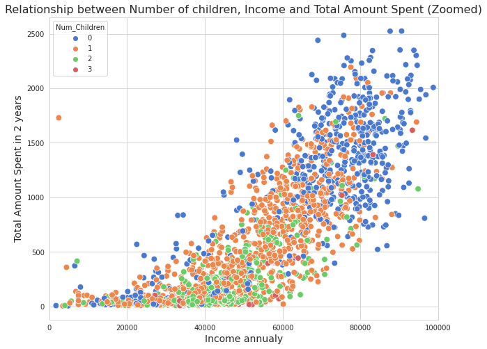

# Customer Segmentation 🏪🛒

> Customer segmentation based on unsupervised clustering of customer records from a grocery company's database.

## Introduction

Customer segmentation consist of grouping customers together based on similar features or properties. The benefits of customer segmentation are:
* Improve your customer service and customer support efforts;
* Hel internal teams prepare for the challenges that different groups are likely to face;
* Communicate with customer segments through preferred channels or platforms;
* Identify new product, support, and service opportunities efficiently.

In this project, I will perform customer segmentation using unsupervised clustering algorithms. This project is divided into four parts:
1. Data cleaning and feature engineering;
2. Exploratory Data Analysis;
3. Clustering using KMeans algorithm;
4. Clustering using agglomerative clustering and perform a dimensionality reduction.

[Customer Personality Analysis](https://www.kaggle.com/datasets/imakash3011/customer-personality-analysis) database taken from Kaggle was used throughout the project.

## Results

### Exploratory Data Analysis

After conducting an exploratory analysis of the data, I found that the customers who had spent the most in the store in the past two years were those without children and those with postgraduate degrees. 

Customers with children spent less than those without children, and the higher the number of children, the lower the store spending. This may be because families are more modest in their daily spending. Customers with a graduate degree spent more (three times more) than customers without a graduate or bachelor's degree. This is because clients with a graduate degree brought in more money than clients without a degree.

The main indicators that determined the amount spent by customers were:
* Income;
* Total amount spent; and 
* Number of children.
These three characteristics are used to segment customers using clustering algorithms.

### KMeans clustering

To keep things simple, first perform a clustering using only three variables (income, total amount spent, and number of children) using the KMeans algorithm. Using the elbow method, I determine that the optimal number of clusters for this experiment is three. 

Based on the results of the clustering process, we have three clusters:
* *Cluster 0* - Customers who spent an average of 227 in the store, have an annual income of ~44,000, and have 2 or more children.
* *Cluster 1* - Customers who spent an average of 1,293 in the store, have an annual income of ~74,500 and do not have children.
* *Cluster 2* - Customers who spent an average of 221 in the store, have an annual income of ~37,800 and have 1 child.

The three clusters and the three variables are shown in the following scatterplot.

As noted in the EDA of the previous section, the more children a family has, the less they spend in the store.

This means that the customers who spend the most (and therefore should be considered) tend to be people without children (or at least 1 child) and with a high annual income. This makes it possible to formulate strategies that will allow this customer profile to continue shopping in the store.

On the other hand, the customers who spend less are those with more than 2 children and an annual income of less than 40,000 (on average). Strategies can be developed to target these profiles to increase store profits.

### Dimensionality reduction and agglomerative clustering

By grouping only three variables (income, total amount spent, and number of children), I can get some information about the customers. While these characteristics can provide valuable customer information, I don't have a complete customer profile; other variables such as marital status, education, or even seniority in the store have not been considered.

In order to include all these variables in our clustering, it is necessary to first perform dimension reduction using Principal Component Analysis (PCA) and then perform agglomerative clustering. The following steps were taken to achieve this:
1. Label encoding the categorical features using `LabelEncoder`;
2. Scale the data using `StandardScaler`;
3. Dimensionality reduction with `PCA`; and
4. Agglomerative clustering (`AgglomerativeClustering`).

The cluster analysis results are shown in the next figure.

## Conclusions

The following information can be deduced about the customers in different clusters.

**About cluster number: 0**
* They have an average annual income of 35,000, they are the customers with the lowest income;
* They are the customers who spend the least in the store, with an average of 107;
* Most of them have no university degree or only a bachelor's degree;
* Most have 1 or more children (children and teenagers);
* Most usually have a partner.

**About cluster number: 1**
* They have an average annual income of 61,000;
* Their average spending in the store was 841;
* Most do not have a college degree;
* Most have 1 or 2 children. They don't have children, but they have teenagers;
* Most have a partner and all are parents;

**About cluster number: 2**
* They have an average annual income of 74,000, they are the customers with the highest income;
* They are the customers who spend the most in the store, with an average of 1,360;
* Most have a Bachelor's degree;
* They do not have children or teenagers at home;
* Some have a partner, some do not, the distribution is the same for this cluster;
* Definitely have no children.

The customer who spent the most in the store was the one with a high annual income, who has an academic degree, who also has no children and who is (mostly) single. The customer profile with the lowest spending in the store was the one with more than 1 child, i.e. mothers and fathers. This can be a turning point for the store's marketing team, as they can make offers or promotions focused on favoring parents.
